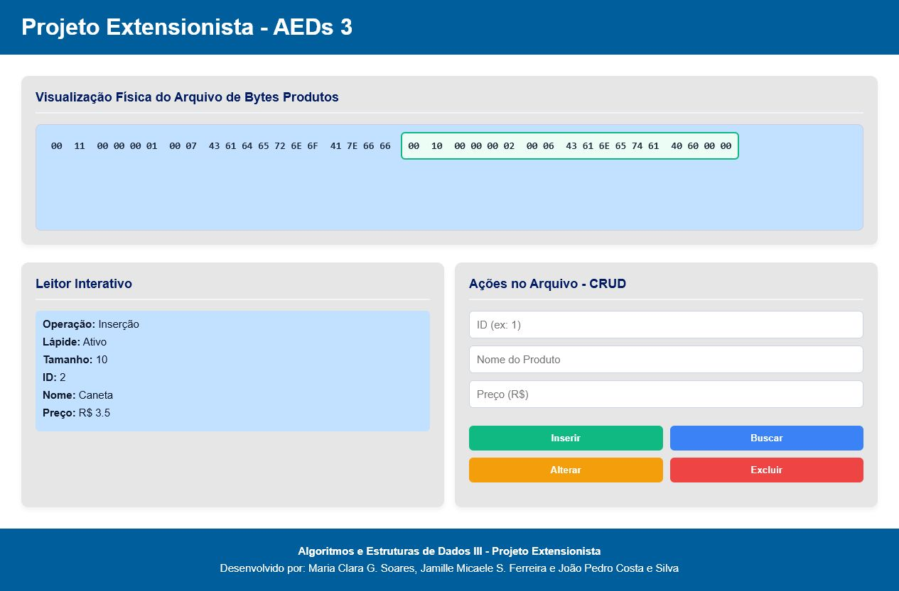
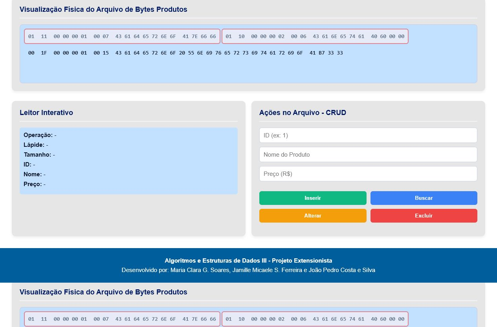

# Relatorio do Trabalho Pratico - AEDs 3

## Participantes

- Maria Clara G. Soares
- Jamille Micaele S. Ferreira
- Joao Pedro Costa e Silva

## Descricao do sistema

Este projeto e uma pagina web interativa para demonstrar o funcionamento de um CRUD de produtos armazenado em uma simulacao de arquivo fisico em bytes.

O sistema permite inserir, buscar, alterar e excluir produtos. Cada produto possui ID, nome e preco. Internamente, os produtos sao serializados para bytes e gravados em um vetor que representa o conteudo de um arquivo. Esse vetor e salvo no `localStorage` do navegador, permitindo que os dados continuem disponiveis mesmo apos recarregar a pagina.

A visualizacao principal mostra os registros do arquivo em hexadecimal, separados em campos de lapide, tamanho e dados. Ao passar o mouse sobre os campos, o painel "Leitor Interativo" mostra a interpretacao daquele trecho, facilitando a compreensao da estrutura fisica do registro.

## Telas do sistema

### Tela inicial


### Insercao de produtos



### Alteracao e exclusao logica



## Estrutura do projeto

- `index.html`: define a estrutura da pagina, os paineis de visualizacao, o formulario do CRUD e a importacao dos scripts.
- `style.css`: define o layout, as cores, os paineis, os botoes e os destaques visuais das operacoes.
- `js/ByteStream.js`: biblioteca de apoio para converter tipos primitivos em bytes e reconstruir valores a partir desses bytes.
- `js/produto.js`: classe `Produto`, responsavel por representar um produto e serializar/desserializar seus dados.
- `js/arquivo.js`: classe `Arquivo`, responsavel por simular o arquivo fisico, armazenar os bytes, listar registros e executar as operacoes de CRUD.
- `js/visualizador.js`: classe `Visualizador`, responsavel por desenhar os bytes na tela em formato hexadecimal.
- `js/app.js`: controla os eventos dos botoes, le os campos do formulario, chama as operacoes do arquivo e atualiza a interface.
- `js/conversor.js`: classe auxiliar para conversao entre texto e bytes. O arquivo esta na pasta do projeto, mas a pagina atual utiliza principalmente o `ByteStream.js` para serializacao.

## Classes criadas

### Classe `Produto`

A classe `Produto` representa os dados de um produto do sistema. Ela possui os atributos:

- `id`: identificador numerico do produto.
- `nome`: nome do produto.
- `preco`: preco do produto.

Ela tambem possui dois metodos principais:

- `serializar()`: converte o produto em uma sequencia de bytes.
- `desserializar(dados)`: reconstrói um objeto `Produto` a partir dos bytes armazenados no arquivo.

Na serializacao, o ID e gravado como inteiro, o nome e gravado como string em bytes e o preco e gravado como float.

### Classe `Arquivo`

A classe `Arquivo` simula o arquivo fisico usado pelo CRUD. Ela mantem um vetor chamado `bytes`, que representa todo o conteudo do arquivo.

Cada registro segue a estrutura:

```text
[LAPIDE] [TAMANHO] [DADOS DO PRODUTO]
```

- `LAPIDE`: indica se o registro esta ativo (`0`) ou excluido (`1`).
- `TAMANHO`: indica a quantidade de bytes ocupada pelos dados do produto.
- `DADOS DO PRODUTO`: contem os bytes gerados pela classe `Produto`.

Principais metodos:

- `adicionarRegistro(dados)`: adiciona um novo registro ativo ao final do arquivo.
- `listar()`: percorre o vetor de bytes e retorna os registros encontrados.
- `buscar(id)`: procura um produto ativo pelo ID.
- `alterar(id, novoProduto)`: marca o registro antigo como excluido e grava uma nova versao ao final do arquivo.
- `excluir(id)`: realiza exclusao logica alterando a lapide do registro para `1`.
- `salvar()` e `carregar()`: persistem e recuperam o vetor de bytes usando `localStorage`.

### Classe `Visualizador`

A classe `Visualizador` desenha os registros na tela. Ela transforma cada parte do registro em hexadecimal e separa visualmente:

- lapide;
- tamanho do registro;
- bytes do ID;
- bytes do tamanho do nome;
- bytes do nome;
- bytes do preco.

O visualizador tambem adiciona eventos de mouse para preencher o painel "Leitor Interativo" com os dados interpretados.

### Classe `ByteStream`

A classe/biblioteca `ByteStream` e usada como apoio para converter valores em bytes e ler bytes de volta para valores. Ela possui funcoes para tipos como `int`, `float`, `string`, `boolean`, `long`, `double`, datas e caracteres.

No projeto, ela e usada principalmente pela classe `Produto` para gravar e ler ID, nome e preco no formato de bytes.

## Operacoes implementadas

### Inserir

A operacao de insercao cria automaticamente um novo ID, monta um objeto `Produto`, serializa o produto em bytes e adiciona um novo registro ativo ao final do arquivo. Depois disso, a tela e atualizada e o registro inserido recebe destaque visual.

### Buscar

A busca recebe um ID informado no formulario. O sistema percorre os registros do arquivo e ignora os registros com lapide `1`. Quando encontra um produto ativo com o ID procurado, preenche os campos do formulario e mostra as informacoes no leitor interativo.

### Alterar

A alteracao recebe o ID do produto e os novos valores de nome e preco. O sistema procura o registro ativo correspondente, marca o registro antigo como excluido usando lapide `1` e adiciona uma nova versao ativa do produto ao final do arquivo. Esse comportamento simula uma alteracao em arquivo com exclusao logica.

### Excluir

A exclusao e logica. Em vez de remover fisicamente os bytes do arquivo, o sistema apenas muda a lapide do registro de `0` para `1`. Dessa forma, o registro continua aparecendo na visualizacao fisica, mas marcado como excluido.

### Visualizacao interativa

A visualizacao mostra o arquivo em bytes e permite observar como cada parte do registro e armazenada. Ao passar o mouse sobre os campos, o painel lateral mostra:

- operacao realizada;
- estado da lapide;
- tamanho do registro;
- ID;
- nome;
- preco.

## Como executar

Nao e necessario instalar dependencias, pois o projeto foi criado apenas com HTML, CSS e JavaScript.

Para executar:

1. Abra o arquivo `index.html` em um navegador.
2. Use o formulario para inserir produtos informando nome e preco.
3. Use o campo ID para buscar, alterar ou excluir produtos.
4. Passe o mouse sobre os bytes exibidos para visualizar a interpretacao dos campos.

## Video de demonstracao

[Assistir ao video de demonstracao](docs/video/video.mp4)

O video de demonstracao esta salvo na pasta `docs/video` do projeto e mostra as principais operacoes do sistema.

## Checklist obrigatorio

- A pagina web com a visualizacao interativa do CRUD de produtos foi criada?  
  **Sim.** A pagina `index.html` possui uma visualizacao interativa do arquivo em bytes, formulario de CRUD e painel de leitura dos campos.

- Ha um video de ate 3 minutos demonstrando o uso da visualizacao?  
  **Sim.** O video esta disponivel no link da secao "Video de demonstracao" deste README.

- O trabalho foi criado apenas com HTML, CSS e JS?  
  **Sim.** O projeto utiliza `index.html`, `style.css` e arquivos JavaScript na pasta `js`, sem backend, frameworks ou dependencias externas.

- O relatorio do trabalho foi entregue no APC?  
  **Sim.** 

- O trabalho esta completo e funcionando sem erros de execucao?  
  **Sim.** O fluxo principal de inserir, buscar, alterar e excluir produtos foi verificado. A pagina tambem foi aberta no navegador para gerar as capturas presentes neste relatorio.

- O trabalho e original e nao a copia de um trabalho de outro grupo?  
  **Sim.** A interface, a integracao do CRUD, a simulacao do arquivo e a visualizacao foram organizadas para este trabalho. O arquivo `ByteStream.js` e usado como biblioteca de apoio e mantem o credito de autoria no proprio codigo.
